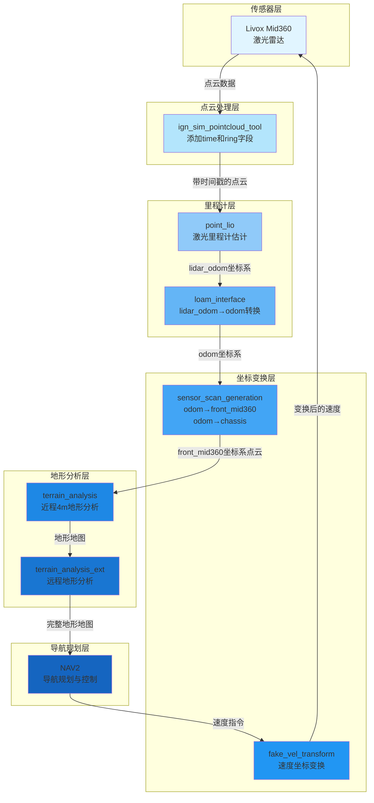

# Navi_Simulation 算法详解

## 目录
1. [项目概述](#项目概述)
2. [系统架构](#系统架构)
3. [核心模块详解](#核心模块详解)
   - [3.1 fake_vel_transform - 速度坐标变换](#31-fake_vel_transform---速度坐标变换)
   - [3.2 ign_sim_pointcloud_tool - 仿真点云转换](#32-ign_sim_pointcloud_tool---仿真点云转换)
   - [3.3 loam_interface - 激光里程计接口](#33-loam_interface---激光里程计接口)
   - [3.4 sensor_scan_generation - 传感器扫描生成](#34-sensor_scan_generation---传感器扫描生成)
   - [3.5 terrain_analysis - 近距离地形分析](#35-terrain_analysis---近距离地形分析)
   - [3.6 terrain_analysis_ext - 远距离地形分析](#36-terrain_analysis_ext---远距离地形分析)
4. [模块间协作关系](#模块间协作关系)
5. [坐标系统](#坐标系统)
6. [算法流程图](#算法流程图)

---

## 项目概述

pb2025_sentry_nav 是基于 NAV2 导航框架开发的机器人导航系统，该系统采用 Livox Mid360 激光雷达作为主要传感器，通过点云里程计（point_lio）进行定位，并结合地形分析算法实现自主导航。

**核心特点：**
- 采用倾斜安装的 Livox Mid360 激光雷达
- 基于点云里程计的精确定位
- 实时地形分析和障碍物检测
- 支持云台扫描模式的速度变换
- 完整的坐标变换链路

---

## 系统架构

### 整体数据流



### 模块依赖关系

```mermaid
graph TB
    subgraph 外部依赖
        A[point_lio 激光里程计算法]
    end

    subgraph 坐标转换模块
        B[loam_interface lidar_odom转odom]
        C[sensor_scan_generation 多坐标系转换]
        D[fake_vel_transform 速度变换]
    end

    subgraph 地形分析模块
        E[terrain_analysis 近程4m地形]
        F[terrain_analysis_ext 远程地形]
    end

    subgraph 导航系统
        G[NAV2 导航框架]
    end

    A -->|输出: lidar_odometry, registered_scan| B
    B -->|输出: lidar_odometry, registered_scan(odom坐标系)| C
    C -->|输出: sensor_scan, odometry, TF: odom到chassis| E
    E -->|输出: terrain_map| F
    F -->|输出: terrain_map_ext| G
    G -->|输出: cmd_vel| D
    D -->|输出: cmd_vel_chassis| A

    style A fill:#ff6b6b
    style B fill:#4ecdc4
    style C fill:#45b7d1
    style D fill:#96ceb4
    style E fill:#ffeaa7
    style F fill:#fdcb6e
    style G fill:#dfe6e9
```

---

## 核心模块详解

### 3.1 fake_vel_transform - 速度坐标变换

#### 功能概述

该模块处理云台扫描模式下的速度变换，将机器人基座坐标系下的速度指令转换为底盘坐标系下的速度指令，同时考虑机器人当前的朝向角度。

#### 核心算法

**1. 坐标系变换原理**

当机器人基座（gimbal_link）相对于底盘旋转时，速度指令需要根据当前朝向进行旋转变换：

```
v_chassis_x = v_robot_x * cos(θ) + v_robot_y * sin(θ)
v_chassis_y = -v_robot_x * sin(θ) + v_robot_y * cos(θ)
ω_chassis_z = ω_robot_z + ω_spin
```

其中：
- `θ` 是机器人基座当前的偏航角（yaw）
- `ω_spin` 是云台自旋速度

**2. 消息同步机制**

使用 `ApproximateTime` 策略同步 `odom` 和 `local_plan` 消息，确保速度变换时使用正确的机器人姿态：

```cpp
sync_ = std::make_unique<message_filters::Synchronizer<SyncPolicy>>(
    SyncPolicy(100), odom_sub_filter_, local_plan_sub_filter_);
```

**3. 超时处理**

当控制器超时（0.5秒）或速度为零时，直接发布变换后的速度，不等待同步：

```cpp
if (is_zero_vel || 
    (rclcpp::Clock().now() - last_controller_activate_time_).seconds() > CONTROLLER_TIMEOUT) {
    auto aft_tf_vel = transformVelocity(msg, current_robot_base_angle_);
    cmd_vel_chassis_pub_->publish(aft_tf_vel);
}
```

**4. TF 发布**

以 50Hz 频率发布从 `robot_base_frame` 到 `fake_robot_base_frame` 的变换，用于可视化：

```cpp
timer_ = this->create_wall_timer(
    std::chrono::milliseconds(20), 
    std::bind(&FakeVelTransform::publishTransform, this));
```

#### 关键代码分析

**速度变换函数** ([fake_vel_transform.cpp#L145-L152](file:///g:/桌面/pb2025_sentry_nav/fake_vel_transform/src/fake_vel_transform.cpp#L145-L152))：

```cpp
geometry_msgs::msg::Twist FakeVelTransform::transformVelocity(
    const geometry_msgs::msg::Twist::SharedPtr & twist, float yaw_diff)
{
  geometry_msgs::msg::Twist aft_tf_vel;
  aft_tf_vel.angular.z = twist->angular.z + spin_speed_;
  aft_tf_vel.linear.x = twist->linear.x * cos(yaw_diff) + twist->linear.y * sin(yaw_diff);
  aft_tf_vel.linear.y = -twist->linear.x * sin(yaw_diff) + twist->linear.y * cos(yaw_diff);
  return aft_tf_vel;
}
```

**同步回调函数** ([fake_vel_transform.cpp#L107-L120](file:///g:/桌面/pb2025_sentry_nav/fake_vel_transform/src/fake_vel_transform.cpp#L107-L120))：

```cpp
void FakeVelTransform::syncCallback(
  const nav_msgs::msg::Odometry::ConstSharedPtr & odom_msg,
  const nav_msgs::msg::Path::ConstSharedPtr & /*local_plan_msg*/)
{
  std::lock_guard<std::mutex> lock(cmd_vel_mutex_);
  geometry_msgs::msg::Twist::SharedPtr current_cmd_vel;
  {
    if (!latest_cmd_vel_) {
      return;
    }
    current_cmd_vel = latest_cmd_vel_;
  }

  current_robot_base_angle_ = tf2::getYaw(odom_msg->pose.pose.orientation);
  float yaw_diff = current_robot_base_angle_;
  geometry_msgs::msg::Twist aft_tf_vel = transformVelocity(current_cmd_vel, yaw_diff);

  cmd_vel_chassis_pub_->publish(aft_tf_vel);
}
```

#### 算法优势

1. **实时性**：使用互斥锁保护共享数据，确保线程安全
2. **鲁棒性**：超时机制防止控制器故障导致速度指令丢失
3. **灵活性**：支持云台自旋速度叠加

---

### 3.2 ign_sim_pointcloud_tool - 仿真点云转换

#### 功能概述

该模块将 Gazebo 仿真环境输出的点云（Velodyne 风格）转换为 point_lio 所需的格式，添加 `time` 和 `ring` 字段。

#### 核心算法

**1. 点云格式转换**

仿真器输出的点云缺少 `time` 和 `ring` 字段，需要根据点的空间位置计算：

```cpp
struct PointXYZIRT {
  PCL_ADD_POINT4D;
  PCL_ADD_INTENSITY;
  uint16_t ring;    // 线束编号
  float time;       // 时间戳
  EIGEN_MAKE_ALIGNED_OPERATOR_NEW;
};
```

**2. 垂直角度计算**

根据点的三维坐标计算垂直角度，用于确定线束编号：

```
vertical_angle = atan2(z, sqrt(x² + y²)) × 180/π
```

**3. 线束编号分配**

将垂直角度映射到线束编号：

```cpp
int row_id = static_cast<int>((vertical_angle + ang_bottom_) / ang_res_y_);
if (row_id >= 0 && row_id < n_scan_) {
    new_point.ring = row_id;
}
```

参数说明：
- `ang_bottom_`：底部垂直角度偏移（7.0°）
- `ang_res_y_`：垂直角度分辨率（1.0°）
- `n_scan_`：线束数量（32）

**4. 时间戳计算**

模拟机械式激光雷达的扫描模式，为每个点分配时间戳：

```cpp
new_point.time = (point_id % horizon_scan_) * 0.1f / horizon_scan_;
```

其中：
- `horizon_scan_`：水平扫描线数（1875）
- `0.1f`：扫描周期（100ms）
- 时间戳范围：[0, 0.1) 秒

#### 关键代码分析

**点云处理回调** ([ign_sim_pointcloud_tool/src/point_cloud_converter.cpp#L42-L82](file:///g:/桌面/pb2025_sentry_nav/ign_sim_pointcloud_tool/src/point_cloud_converter.cpp#L42-L82))：

```cpp
void PointCloudConverter::lidarHandle(const sensor_msgs::msg::PointCloud2::SharedPtr pc_msg)
{
  pcl::PointCloud<pcl::PointXYZ>::Ptr original_pc(new pcl::PointCloud<pcl::PointXYZ>());
  pcl::PointCloud<PointXYZIRT>::Ptr converted_pc(new pcl::PointCloud<PointXYZIRT>());

  pcl::fromROSMsg(*pc_msg, *original_pc);

  for (size_t point_id = 0; point_id < original_pc->points.size(); ++point_id) {
    PointXYZIRT new_point;
    const auto & old_point = original_pc->points[point_id];

    new_point.x = old_point.x;
    new_point.y = old_point.y;
    new_point.z = old_point.z;
    new_point.intensity = 0;

    float vertical_angle =
      std::atan2(new_point.z, std::sqrt(new_point.x * new_point.x + new_point.y * new_point.y)) *
      180 / M_PI;
    int row_id = static_cast<int>((vertical_angle + ang_bottom_) / ang_res_y_);

    if (row_id >= 0 && row_id < n_scan_) {
      new_point.ring = row_id;
    } else {
      continue;
    }

    new_point.time = (point_id % horizon_scan_) * 0.1f / horizon_scan_;

    converted_pc->points.push_back(new_point);
  }

  publishPoints<PointXYZIRT>(converted_pc, *pc_msg);
}
```

#### 算法优势

1. **兼容性**：使仿真环境与真实传感器数据格式一致
2. **准确性**：基于几何关系计算线束编号和时间戳
3. **效率**：单次遍历完成所有转换

---

### 3.3 loam_interface - 激光里程计接口

#### 功能概述

该模块将 point_lio 输出的点云和里程计从 `lidar_odom` 坐标系转换到 `odom` 坐标系，处理激光雷达与底盘之间的安装偏移。

#### 核心算法

**1. 坐标系关系**

```
odom → base_link → lidar_link
     ↓
lidar_odom (point_lio 输出)
```

**2. 初始化变换矩阵**

首次启动时，从 TF 树中获取 `base_link` 到 `lidar_link` 的静态变换：

```cpp
auto tf_stamped = tf_buffer_->lookupTransform(
    base_frame_, lidar_frame_, msg->header.stamp, rclcpp::Duration::from_seconds(0.5));
tf2::fromMsg(tf_stamped.transform, tf_base_frame_to_lidar);
tf_odom_to_lidar_odom_ = tf_base_frame_to_lidar;
```

**3. 里程计变换**

将 `lidar_odom` 坐标系下的里程计转换到 `odom` 坐标系：

```
T_odom_to_lidar = T_odom_to_lidar_odom × T_lidar_odom_to_lidar
```

其中：
- `T_odom_to_lidar_odom`：初始化时获取的静态变换
- `T_lidar_odom_to_lidar`：point_lio 输出的位姿

**4. 点云变换**

将点云从 `lidar_odom` 坐标系转换到 `odom` 坐标系：

```cpp
pcl_ros::transformPointCloud(odom_frame_, tf_odom_to_lidar_odom_, *msg, *out);
```

#### 关键代码分析

**里程计回调** ([loam_interface/src/loam_interface.cpp#L60-L95](file:///g:/桌面/pb2025_sentry_nav/loam_interface/src/loam_interface.cpp#L60-L95))：

```cpp
void LoamInterfaceNode::odometryCallback(const nav_msgs::msg::Odometry::ConstSharedPtr msg)
{
  if (!base_frame_to_lidar_initialized_) {
    try {
      auto tf_stamped = tf_buffer_->lookupTransform(
        base_frame_, lidar_frame_, msg->header.stamp, rclcpp::Duration::from_seconds(0.5));
      tf2::Transform tf_base_frame_to_lidar;
      tf2::fromMsg(tf_stamped.transform, tf_base_frame_to_lidar);
      tf_odom_to_lidar_odom_ = tf_base_frame_to_lidar;
      base_frame_to_lidar_initialized_ = true;
    } catch (tf2::TransformException & ex) {
      RCLCPP_WARN(this->get_logger(), "TF lookup failed: %s Retrying...", ex.what());
      return;
    }
  }

  tf2::Transform tf_lidar_odom_to_lidar;
  tf2::fromMsg(msg->pose.pose, tf_lidar_odom_to_lidar);
  tf2::Transform tf_odom_to_lidar = tf_odom_to_lidar_odom_ * tf_lidar_odom_to_lidar;

  nav_msgs::msg::Odometry out;
  out.header.stamp = msg->header.stamp;
  out.header.frame_id = odom_frame_;
  out.child_frame_id = lidar_frame_;

  const auto & origin = tf_odom_to_lidar.getOrigin();
  out.pose.pose.position.x = origin.x();
  out.pose.pose.position.y = origin.y();
  out.pose.pose.position.z = origin.z();
  out.pose.pose.orientation = tf2::toMsg(tf_odom_to_lidar.getRotation());

  odom_pub_->publish(out);
}
```

#### 算法优势

1. **解耦性**：将 point_lio 的坐标系与导航系统分离
2. **灵活性**：支持激光雷达任意安装位置
3. **鲁棒性**：TF 查询失败时自动重试

---

### 3.4 sensor_scan_generation - 传感器扫描生成

#### 功能概述

该模块将点云从 `odom` 坐标系转换到 `front_mid360` 坐标系，并发布 `odom` 到 `chassis` 的变换和底盘里程计。

#### 核心算法

**1. 坐标系变换链**

```
lidar_odom → odom → chassis
           ↓
      front_mid360
```

**2. 同步处理**

使用 `ApproximateTime` 策略同步里程计和点云消息：

```cpp
sync_ = std::make_unique<message_filters::Synchronizer<SyncPolicy>>(
    SyncPolicy(100), odometry_sub_, laser_cloud_sub_);
```

**3. 变换计算**

计算各个坐标系之间的变换：

```cpp
tf2::fromMsg(odometry_msg->pose.pose, tf_odom_to_lidar);
tf_lidar_to_robot_base_ = getTransform(lidar_frame_, robot_base_frame_, pcd_msg->header.stamp);
tf_lidar_to_chassis = getTransform(lidar_frame_, base_frame_, pcd_msg->header.stamp);

tf_odom_to_chassis = tf_odom_to_lidar * tf_lidar_to_chassis;
tf_odom_to_robot_base = tf_odom_to_lidar * tf_lidar_to_robot_base_;
```

**4. 点云变换**

将点云从 `odom` 坐标系转换到 `front_mid360` 坐标系：

```cpp
pcl_ros::transformPointCloud(lidar_frame_, tf_odom_to_lidar.inverse(), *pcd_msg, out);
```

**5. 速度计算**

通过位姿差分计算线速度和角速度：

```cpp
const double dt = std::chrono::duration_cast<std::chrono::nanoseconds>(
    current_time - previous_time).count() * 1e-9;

const auto linear_velocity = (transform.getOrigin() - previous_transform.getOrigin()) / dt;

const tf2::Quaternion q_diff = transform.getRotation() * 
    previous_transform.getRotation().inverse();
const auto angular_velocity = q_diff.getAxis() * q_diff.getAngle() / dt;
```

#### 关键代码分析

**同步回调函数** ([sensor_scan_generation/src/sensor_scan_generation.cpp#L38-L62](file:///g:/桌面/pb2025_sentry_nav/sensor_scan_generation/src/sensor_scan_generation.cpp#L38-L62))：

```cpp
void SensorScanGenerationNode::laserCloudAndOdometryHandler(
  const nav_msgs::msg::Odometry::ConstSharedPtr & odometry_msg,
  const sensor_msgs::msg::PointCloud2::ConstSharedPtr & pcd_msg)
{
  tf2::Transform tf_lidar_to_chassis;
  tf2::Transform tf_odom_to_chassis;
  tf2::Transform tf_odom_to_robot_base;
  tf2::Transform tf_odom_to_lidar;

  tf2::fromMsg(odometry_msg->pose.pose, tf_odom_to_lidar);
  tf_lidar_to_robot_base_ = getTransform(lidar_frame_, robot_base_frame_, pcd_msg->header.stamp);
  tf_lidar_to_chassis = getTransform(lidar_frame_, base_frame_, pcd_msg->header.stamp);

  tf_odom_to_chassis = tf_odom_to_lidar * tf_lidar_to_chassis;
  tf_odom_to_robot_base = tf_odom_to_lidar * tf_lidar_to_robot_base_;

  publishTransform(
    tf_odom_to_chassis, odometry_msg->header.frame_id, base_frame_, pcd_msg->header.stamp);
  publishOdometry(
    tf_odom_to_robot_base, odometry_msg->header.frame_id, robot_base_frame_, pcd_msg->header.stamp);

  sensor_msgs::msg::PointCloud2 out;
  pcl_ros::transformPointCloud(lidar_frame_, tf_odom_to_lidar.inverse(), *pcd_msg, out);
  pub_laser_cloud_->publish(out);
}
```

#### 算法优势

1. **完整性**：同时发布点云、TF 和里程计
2. **准确性**：使用位姿差分计算速度，避免数值微分误差
3. **实时性**：使用 QoS 策略优化消息传输

---

### 3.5 terrain_analysis - 近距离地形分析

#### 功能概述

该模块分析机器人周围 4m 范围内的地形，计算障碍物相对于地面的高度，并将高度信息存储在点云的 `intensity` 字段中。

#### 核心算法

**1. 地形体素化**

使用滚动体素网格（rolling voxel grid）存储历史点云：

```cpp
const int terrainVoxelWidth = 21;
const int terrainVoxelHalfWidth = (terrainVoxelWidth - 1) / 2;
constexpr int kTerrainVoxelNum = terrainVoxelWidth * terrainVoxelWidth;
```

体素大小：1.0m × 1.0m，覆盖范围：21m × 21m

**2. 体素滚动机制**

当机器人移动时，体素网格随之滚动，保持机器人位于网格中心：

```cpp
while (vehicleX - terrainVoxelCenX < -terrainVoxelSize) {
    // 向左滚动：将最右列移到最左列
    for (int indY = 0; indY < terrainVoxelWidth; indY++) {
        pcl::PointCloud<pcl::PointXYZI>::Ptr terrainVoxelCloudPtr =
            terrainVoxelCloud[terrainVoxelWidth * (terrainVoxelWidth - 1) + indY];
        for (int indX = terrainVoxelWidth - 1; indX >= 1; indX--) {
            terrainVoxelCloud[terrainVoxelWidth * indX + indY] =
                terrainVoxelCloud[terrainVoxelWidth * (indX - 1) + indY];
        }
        terrainVoxelCloud[indY] = terrainVoxelCloudPtr;
        terrainVoxelCloud[indY]->clear();
    }
    terrainVoxelShiftX--;
    terrainVoxelCenX = terrainVoxelSize * terrainVoxelShiftX;
}
```

**3. 点云衰减**

根据点云的时间戳进行衰减，移除过时的点：

```cpp
if (point.z - vehicleZ > minRelZ - disRatioZ * dis &&
    point.z - vehicleZ < maxRelZ + disRatioZ * dis &&
    (laserCloudTime - systemInitTime - point.intensity < decayTime || dis < noDecayDis) &&
    !(dis < clearingDis && clearingCloud)) {
    terrainVoxelCloudPtr->push_back(point);
}
```

参数说明：
- `decayTime`：衰减时间（2.0秒）
- `noDecayDis`：不衰减距离（4.0m）
- `clearingDis`：清除距离（8.0m）

**4. 地面估计**

使用平面体素网格估计地面高度：

```cpp
const int planarVoxelWidth = 51;
const int planarVoxelHalfWidth = (planarVoxelWidth - 1) / 2;
constexpr int kPlanarVoxelNum = planarVoxelWidth * planarVoxelWidth;
```

体素大小：0.2m × 0.2m，覆盖范围：10.2m × 10.2m

**5. 地面高度计算**

对于每个平面体素，收集周围 3×3 体素内的点，计算地面高度：

```cpp
for (int dX = -1; dX <= 1; dX++) {
    for (int dY = -1; dY <= 1; dY++) {
        if (indX + dX >= 0 && indX + dX < planarVoxelWidth &&
            indY + dY >= 0 && indY + dY < planarVoxelWidth) {
            planarPointElev[planarVoxelWidth * (indX + dX) + indY + dY].push_back(point.z);
        }
    }
}
```

**6. 分位数滤波**

使用分位数滤波去除离群点，提高地面估计的鲁棒性：

```cpp
if (useSorting) {
    sort(planarPointElev[i].begin(), planarPointElev[i].end());
    int quantileID = static_cast<int>(quantileZ * planarPointElevSize);
    if (quantileID < 0) quantileID = 0;
    else if (quantileID >= planarPointElevSize) quantileID = planarPointElevSize - 1;

    if (planarPointElev[i][quantileID] > planarPointElev[i][0] + maxGroundLift &&
        limitGroundLift) {
        planarVoxelElev[i] = planarPointElev[i][0] + maxGroundLift;
    } else {
        planarVoxelElev[i] = planarPointElev[i][quantileID];
    }
}
```

参数说明：
- `quantileZ`：分位数（0.25，即 25% 分位数）
- `maxGroundLift`：最大地面抬升（0.15m）

**7. 动态障碍物检测**

检测动态障碍物（如移动的机器人）：

```cpp
if (clearDyObs) {
    float pointX1 = point.x - vehicleX;
    float pointY1 = point.y - vehicleY;
    float pointZ1 = point.z - vehicleZ;

    float dis1 = sqrt(pointX1 * pointX1 + pointY1 * pointY1);
    if (dis1 > minDyObsDis) {
        float angle1 = atan2(pointZ1 - minDyObsRelZ, dis1) * 180.0 / M_PI;
        if (angle1 > minDyObsAngle) {
            // 将点转换到机器人坐标系
            float pointX2 = pointX1 * cosVehicleYaw + pointY1 * sinVehicleYaw;
            float pointY2 = -pointX1 * sinVehicleYaw + pointY1 * cosVehicleYaw;
            float pointZ2 = pointZ1;

            float pointX3 = pointX2 * cosVehiclePitch - pointZ2 * sinVehiclePitch;
            float pointY3 = pointY2;
            float pointZ3 = pointX2 * sinVehiclePitch + pointZ2 * cosVehiclePitch;

            float pointX4 = pointX3;
            float pointY4 = pointY3 * cosVehicleRoll + pointZ3 * sinVehicleRoll;
            float pointZ4 = -pointY3 * sinVehicleRoll + pointZ3 * cosVehicleRoll;

            float dis4 = sqrt(pointX4 * pointX4 + pointY4 * pointY4);
            float angle4 = atan2(pointZ4, dis4) * 180.0 / M_PI;
            if ((angle4 > minDyObsVFOV && angle4 < maxDyObsVFOV) ||
                fabs(pointZ4) < absDyObsRelZThre) {
                planarVoxelDyObs[planarVoxelWidth * indX + indY]++;
            }
        }
    }
}
```

**8. 障碍物高度计算**

计算每个点相对于地面的高度，存储在 `intensity` 字段：

```cpp
float disZ = point.z - planarVoxelElev[planarVoxelWidth * indX + indY];
if (considerDrop) disZ = fabs(disZ);
int planarPointElevSize = planarPointElev[planarVoxelWidth * indX + indY].size();
if (disZ >= 0 && disZ < vehicleHeight && planarPointElevSize >= minBlockPointNum) {
    terrainCloudElev->push_back(point);
    terrainCloudElev->points[terrainCloudElevSize].intensity = disZ;
    terrainCloudElevSize++;
}
```

**9. 无数据区域处理**

将无数据区域标记为障碍物：

```cpp
if (noDataObstacle && noDataInited == 2) {
    for (int i = 0; i < kPlanarVoxelNum; i++) {
        int planarPointElevSize = planarPointElev[i].size();
        if (planarPointElevSize < minBlockPointNum) {
            planarVoxelEdge[i] = 1;
        }
    }
}
```

#### 关键代码分析

**主循环** ([terrain_analysis/src/terrainAnalysis.cpp#L287-L652](file:///g:/桌面/pb2025_sentry_nav/terrain_analysis/src/terrainAnalysis.cpp#L287-L652))：

```cpp
while (status) {
    rclcpp::spin_some(nh);
    if (newlaserCloud) {
        newlaserCloud = false;

        // 1. 地形体素滚动
        // 2. 点云堆叠
        // 3. 体素下采样
        // 4. 地面估计
        // 5. 障碍物高度计算
        // 6. 无数据区域处理

        pubLaserCloud->publish(terrainCloudElevMsg);
    }
    rate.sleep();
}
```

#### 算法优势

1. **实时性**：滚动体素网格避免频繁内存分配
2. **鲁棒性**：分位数滤波和点云衰减提高稳定性
3. **完整性**：处理无数据区域，避免漏检障碍物

---

### 3.6 terrain_analysis_ext - 远距离地形分析

#### 功能概述

该模块分析机器人周围 4m 以外的地形，计算障碍物相对于地面的高度，并与近距离地形分析结果融合。

#### 核心算法

**1. 地形连通性检查**

使用广度优先搜索（BFS）检查地形的连通性，移除天花板等不连通区域：

```cpp
int ind = planarVoxelWidth * planarVoxelHalfWidth + planarVoxelHalfWidth;
if (planarPointElev[ind].size() == 0)
    planarVoxelElev[ind] = vehicleZ + terrainUnderVehicle;

planarVoxelQueue.push(ind);
planarVoxelConn[ind] = 1;
while (!planarVoxelQueue.empty()) {
    int front = planarVoxelQueue.front();
    planarVoxelConn[front] = 2;
    planarVoxelQueue.pop();

    int indX = static_cast<int>(front / planarVoxelWidth);
    int indY = front % planarVoxelWidth;
    for (int dX = -10; dX <= 10; dX++) {
        for (int dY = -10; dY <= 10; dY++) {
            if (indX + dX >= 0 && indX + dX < planarVoxelWidth &&
                indY + dY >= 0 && indY + dY < planarVoxelWidth) {
                ind = planarVoxelWidth * (indX + dX) + indY + dY;
                if (planarVoxelConn[ind] == 0 && planarPointElev[ind].size() > 0) {
                    if (fabs(planarVoxelElev[front] - planarVoxelElev[ind]) < terrainConnThre) {
                        planarVoxelQueue.push(ind);
                        planarVoxelConn[ind] = 1;
                    } else if (fabs(planarVoxelElev[front] - planarVoxelElev[ind]) > 
                               ceilingFilteringThre) {
                        planarVoxelConn[ind] = -1;
                    }
                }
            }
        }
    }
}
```

参数说明：
- `terrainUnderVehicle`：机器人下方地面高度（-0.75m）
- `terrainConnThre`：连通性阈值（0.5m）
- `ceilingFilteringThre`：天花板过滤阈值（2.0m）

**2. 远距离地形处理**

处理距离机器人超过 `localTerrainMapRadius`（4.0m）的点：

```cpp
for (int i = 0; i < terrainCloudSize; i++) {
    point = terrainCloud->points[i];
    float dis = sqrt((point.x - vehicleX) * (point.x - vehicleX) +
                     (point.y - vehicleY) * (point.y - vehicleY));
    if (point.z - vehicleZ > lowerBoundZ - disRatioZ * dis &&
        point.z - vehicleZ < upperBoundZ + disRatioZ * dis &&
        dis > localTerrainMapRadius) {
        // 计算障碍物高度
        int indX = static_cast<int>((point.x - vehicleX + planarVoxelSize / 2) / planarVoxelSize) +
                   planarVoxelHalfWidth;
        int indY = static_cast<int>((point.y - vehicleY + planarVoxelSize / 2) / planarVoxelSize) +
                   planarVoxelHalfWidth;

        if (indX >= 0 && indX < planarVoxelWidth && indY >= 0 && indY < planarVoxelWidth) {
            if (planarVoxelConn[planarVoxelWidth * indX + indY] != -1) {
                float disZ = point.z - planarVoxelElev[planarVoxelWidth * indX + indY];
                if (disZ >= 0 && disZ < vehicleHeight) {
                    terrainCloudElev->push_back(point);
                    terrainCloudElev->points[terrainCloudElevSize].intensity = disZ;
                    terrainCloudElevSize++;
                }
            }
        }
    }
}
```

**3. 与近距离地形融合**

将近距离地形分析结果与远距离地形分析结果融合：

```cpp
auto subTerrainCloudLocal =
    nh->create_subscription<sensor_msgs::msg::PointCloud2>(
        "terrain_map", 2, terrainCloudLocalHandler);

void terrainCloudLocalHandler(
    const sensor_msgs::msg::PointCloud2::ConstSharedPtr terrainCloudLocal2) {
    terrainCloudLocal->clear();
    pcl::fromROSMsg(*terrainCloudLocal2, *terrainCloudLocal);
}
```

#### 关键代码分析

**主循环** ([terrain_analysis_ext/src/terrainAnalysisExt.cpp#L287-L571](file:///g:/桌面/pb2025_sentry_nav/terrain_analysis_ext/src/terrainAnalysisExt.cpp#L287-L571))：

```cpp
while (status) {
    rclcpp::spin_some(nh);

    if (newlaserCloud) {
        newlaserCloud = false;

        // 1. 地形体素滚动
        // 2. 点云堆叠
        // 3. 体素下采样
        // 4. 地面估计
        // 5. 地形连通性检查
        // 6. 远距离障碍物高度计算
        // 7. 与近距离地形融合

        pubTerrainCloud->publish(terrainCloudElevMsg);
    }
    rate.sleep();
}
```

#### 算法优势

1. **完整性**：覆盖近距离和远距离地形
2. **鲁棒性**：连通性检查过滤天花板等不连通区域
3. **融合性**：与近距离地形分析结果无缝融合

---

## 模块间协作关系

### 数据流向

```
Livox Mid360
    ↓
ign_sim_pointcloud_tool (添加 time 和 ring 字段)
    ↓
point_lio (里程计估计)
    ↓
loam_interface (lidar_odom → odom)
    ↓
sensor_scan_generation (odom → front_mid360, odom → chassis)
    ↓
terrain_analysis (近程4m地形)
    ↓
terrain_analysis_ext (远程地形)
    ↓
NAV2 (导航规划)
```

### 消息传递

| 模块 | 订阅话题 | 发布话题 |
|------|---------|---------|
| fake_vel_transform | odom, local_plan, cmd_vel, cmd_spin | cmd_vel_chassis, TF |
| ign_sim_pointcloud_tool | livox/lidar | velodyne_points |
| loam_interface | state_estimation, registered_scan | lidar_odometry, registered_scan |
| sensor_scan_generation | lidar_odometry, registered_scan | sensor_scan, odometry, TF |
| terrain_analysis | lidar_odometry, registered_scan, joy, map_clearing | terrain_map |
| terrain_analysis_ext | lidar_odometry, registered_scan, terrain_map | terrain_map_ext |

### 坐标变换链

```
map → odom → chassis → base_link → gimbal_link → front_mid360
                  ↓
              lidar_link
```

---

## 坐标转换详解

### 为什么需要坐标转换？

在机器人导航系统中，由于传感器（如激光雷达）和机器人底盘之间存在安装偏移，以及不同模块使用不同的参考坐标系，因此需要进行坐标转换。本项目的核心挑战在于：

1. **激光雷达倾斜安装**：Livox Mid360 激光雷达倾斜侧放在底盘上，导致激光雷达坐标系与底盘坐标系不一致
2. **里程计坐标系分离**：point_lio 输出的里程计基于 `lidar_odom` 坐标系，而导航系统需要基于 `odom` 坐标系
3. **多传感器融合**：需要将不同传感器的数据统一到同一坐标系下进行处理

### 坐标转换链路详解

#### 完整的坐标转换链

```
map (全局地图)
  ↓
odom (里程计坐标系)
  ↓
chassis (底盘坐标系)
  ↓
base_link (机器人基座坐标系)
  ↓
gimbal_link (云台坐标系)
  ↓
front_mid360 (前方激光雷达坐标系)
  ↓
lidar_link (激光雷达坐标系)
```

#### 关键转换步骤

**步骤 1：point_lio 输出处理**

point_lio 算法输出的数据基于 `lidar_odom` 坐标系，这是激光雷达自身的里程计坐标系。

**步骤 2：loam_interface 转换**

[loam_interface](./loam_interface/) 模块将 point_lio 输出的数据从 `lidar_odom` 坐标系转换到 `odom` 坐标系：

```
T_odom_to_lidar = T_odom_to_lidar_odom × T_lidar_odom_to_lidar
```

其中：
- `T_odom_to_lidar_odom`：初始化时从 TF 树中获取的静态变换（`base_link` 到 `lidar_link`）
- `T_lidar_odom_to_lidar`：point_lio 输出的激光雷达位姿

**步骤 3：sensor_scan_generation 转换**

[sensor_scan_generation](./sensor_scan_generation/) 模块执行以下转换：

1. 将点云从 `odom` 坐标系转换到 `front_mid360` 坐标系：
   ```
   T_front_mid360_to_odom = T_odom_to_lidar × T_lidar_to_front_mid360
   ```

2. 发布 `odom` 到 `chassis` 的变换：
   ```
   T_odom_to_chassis = T_odom_to_lidar × T_lidar_to_chassis
   ```

3. 计算并发布底盘里程计：
   ```
   T_odom_to_robot_base = T_odom_to_lidar × T_lidar_to_robot_base
   ```

### 隐式变换的含义

"隐式变换"指的是 `lidar_odom` 与 `odom` 之间的变换关系不是直接发布的，而是通过以下方式隐式建立的：

1. **初始化时**：从 TF 树中获取 `base_link` 到 `lidar_link` 的静态变换
2. **运行时**：将 point_lio 输出的位姿与静态变换结合，得到 `odom` 坐标系下的位姿

这种设计的优势：
- **灵活性**：支持激光雷达任意安装位置和角度
- **解耦性**：point_lio 算法不需要关心底盘坐标系
- **可维护性**：修改激光雷达安装位置只需更新 TF 树，无需修改算法代码

### 坐标转换的数学原理

#### 2D 旋转变换

当两个坐标系在水平面上存在旋转角度 θ 时，点的坐标变换公式为：

```
x' = x × cos(θ) + y × sin(θ)
y' = -x × sin(θ) + y × cos(θ)
```

#### 3D 齐次变换

完整的 3D 变换使用 4×4 齐次变换矩阵：

```
| R   t |
| 0   1 |
```

其中：
- `R` 是 3×3 旋转矩阵
- `t` 是 3×1 平移向量

#### 变换矩阵的乘法

多个变换可以通过矩阵乘法组合：

```
T_A_to_C = T_A_to_B × T_B_to_C
```

注意：变换矩阵的乘法顺序是从右到左，即先应用 `T_B_to_C`，再应用 `T_A_to_B`。

### 坐标转换的实际应用

#### 示例：将激光雷达点转换到底盘坐标系

假设激光雷达安装在底盘前方 0.5m、上方 0.3m 的位置，且激光雷达向前倾斜 30°。

步骤 1：定义变换参数
```
平移：t = [0.5, 0, 0.3]
旋转：roll = 0°, pitch = 30°, yaw = 0°
```

步骤 2：构建旋转矩阵
```
R = Rz(0°) × Ry(30°) × Rx(0°)
```

步骤 3：构建齐次变换矩阵
```
T_lidar_to_chassis = | R   t |
                   | 0   1 |
```

步骤 4：应用变换
```
P_chassis = T_lidar_to_chassis × P_lidar
```

---

## Namespace 详解

### 什么是 Namespace？

Namespace（命名空间）是 ROS2 中用于隔离不同节点、话题、服务、参数等资源的机制。通过为资源添加前缀，可以避免多个机器人或多个节点之间的名称冲突。

### 为什么需要 Namespace？

在多机器人系统中，每个机器人都有相同类型的节点和话题，例如：

- 每个机器人都有一个导航控制器
- 每个机器人都发布 `/cmd_vel` 话题
- 每个机器人都订阅 `/scan` 话题

如果没有 Namespace，这些节点和话题会相互冲突，导致系统无法正常工作。

### Namespace 的使用方式

#### 1. 在 Launch 文件中设置 Namespace

在 launch 文件中使用 `namespace` 参数为节点添加命名空间前缀：

```python
from launch import LaunchDescription
from launch_ros.actions import Node

def generate_launch_description():
    return LaunchDescription([
        Node(
            package='nav2_controller',
            executable='controller_server',
            name='controller_server',
            namespace='red_standard_robot1',  # 设置 namespace
            output='screen',
            parameters=[...]
        )
    ])
```

#### 2. 在命令行中设置 Namespace

使用 `--ros-args` 和 `-r` 参数重映射话题：

```bash
ros2 run rqt_tf_tree rqt_tf_tree \
    --ros-args \
    -r /tf:=tf \
    -r /tf_static:=tf_static \
    -r __ns:=/red_standard_robot1
```

参数说明：
- `-r /tf:=tf`：将 `/tf` 话题重映射为 `tf`
- `-r /tf_static:=tf_static`：将 `/tf_static` 话题重映射为 `tf_static`
- `-r __ns:=/red_standard_robot1`：设置命名空间为 `/red_standard_robot1`

#### 3. Namespace 对话题名称的影响

添加 Namespace 后，话题名称会自动添加前缀：

| 原始话题名称 | 添加 Namespace 后的名称 |
|--------------|---------------------|
| `/cmd_vel` | `/red_standard_robot1/cmd_vel` |
| `/scan` | `/red_standard_robot1/scan` |
| `/odom` | `/red_standard_robot1/odom` |
| `/tf` | `/tf` (需要特殊重映射) |
| `/tf_static` | `/tf_static` (需要特殊重映射) |

#### 4. Namespace 对节点名称的影响

添加 Namespace 后，节点名称会自动添加前缀：

| 原始节点名称 | 添加 Namespace 后的名称 |
|--------------|---------------------|
| `controller_server` | `/red_standard_robot1/controller_server` |
| `planner_server` | `/red_standard_robot1/planner_server` |
| `behavior_server` | `/red_standard_robot1/behavior_server` |

### Namespace 在本项目中的应用

#### 默认 Namespace

本项目的默认 Namespace 为 `red_standard_robot1`，可以在 launch 文件中通过参数修改：

```python
namespace_arg = DeclareLaunchArgument(
    'namespace',
    default_value='red_standard_robot1',
    description='Top-level namespace'
)
```

#### 多机器人配置

在多机器人场景中，为每个机器人分配不同的 Namespace：

```bash
ros2 launch pb2025_nav_bringup rm_multi_navigation_simulation_launch.py \
    robots:=" \
    red_standard_robot1={x: 0.0, y: 0.0, yaw: 0.0}; \
    blue_standard_robot1={x: 5.6, y: 1.4, yaw: 3.14}; \
    "
```

这会创建两个机器人，分别使用 `red_standard_robot1` 和 `blue_standard_robot1` 作为 Namespace。

#### TF 树的特殊处理

由于 TF 系统需要全局共享，因此 TF 话题不使用 Namespace 前缀，而是通过重映射实现：

```python
remappings = [
    ('/tf', 'tf'),
    ('/tf_static', 'tf_static')
]
```

### Namespace 的优势

1. **隔离性**：不同机器人的节点和话题互不干扰
2. **可扩展性**：轻松添加更多机器人
3. **灵活性**：可以动态添加和移除机器人
4. **可维护性**：每个机器人的配置独立管理

### Namespace 的注意事项

1. **TF 话题重映射**：TF 话题必须正确重映射，否则 TF 树会混乱
2. **参数文件路径**：参数文件中的话题名称需要考虑 Namespace 前缀
3. **RViz 配置**：RViz 中的 Fixed Frame 需要设置为完整的坐标系名称（如 `/red_standard_robot1/odom`）
4. **服务调用**：调用服务时需要指定完整的命名空间路径

### Namespace 实际使用示例

#### 查看特定机器人的 TF 树

```bash
ros2 run rqt_tf_tree rqt_tf_tree \
    --ros-args \
    -r /tf:=tf \
    -r /tf_static:=tf_static \
    -r __ns:=/red_standard_robot1
```

#### 发布特定机器人的速度指令

```bash
ros2 topic pub /red_standard_robot1/cmd_vel geometry_msgs/msg/Twist \
    "{linear: {x: 0.5, y: 0.0, z: 0.0}, angular: {x: 0.0, y: 0.0, z: 0.0}}"
```

#### 查看特定机器人的话题列表

```bash
ros2 topic list | grep red_standard_robot1
```

---

## 坐标系统

### 坐标系定义

| 坐标系 | 说明 |
|--------|------|
| map | 全局地图坐标系 |
| odom | 里程计坐标系 |
| chassis | 底盘坐标系 |
| base_link | 机器人基座坐标系 |
| gimbal_link | 云台坐标系 |
| front_mid360 | 前方激光雷达坐标系 |
| lidar_link | 激光雷达坐标系 |
| lidar_odom | 激光雷达里程计坐标系 |

### 坐标变换关系

```
T_odom_to_chassis = T_odom_to_lidar × T_lidar_to_chassis
T_odom_to_robot_base = T_odom_to_lidar × T_lidar_to_robot_base
T_odom_to_lidar = T_odom_to_lidar_odom × T_lidar_odom_to_lidar
```

---

## 算法流程图

### 整体流程

```
开始
  ↓
传感器数据采集
  ↓
点云格式转换 (ign_sim_pointcloud_tool)
  ↓
里程计估计 (point_lio)
  ↓
坐标变换 (loam_interface)
  ↓
传感器扫描生成 (sensor_scan_generation)
  ↓
地形分析 (terrain_analysis + terrain_analysis_ext)
  ↓
导航规划 (NAV2)
  ↓
速度指令生成
  ↓
速度变换 (fake_vel_transform)
  ↓
底盘控制
  ↓
结束
```

### 地形分析流程

```
开始
  ↓
点云裁剪
  ↓
地形体素滚动
  ↓
点云堆叠
  ↓
体素下采样
  ↓
点云衰减
  ↓
地面估计
  ↓
动态障碍物检测
  ↓
障碍物高度计算
  ↓
无数据区域处理
  ↓
发布地形地图
  ↓
结束
```

---

## 总结

pb2025_sentry_nav 是一个完整的机器人导航系统，包含以下核心算法：

1. **速度坐标变换**：处理云台扫描模式下的速度指令变换
2. **仿真点云转换**：使仿真环境与真实传感器数据格式一致
3. **激光里程计接口**：处理激光雷达与底盘之间的安装偏移
4. **传感器扫描生成**：生成传感器扫描数据和底盘里程计
5. **近距离地形分析**：分析机器人周围 4m 范围内的地形
6. **远距离地形分析**：分析机器人周围 4m 以外的地形

这些模块协同工作，实现了从传感器数据采集到导航规划的完整流程，为哨兵机器人提供了可靠的自主导航能力。
